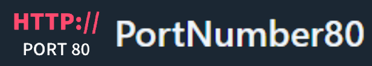

<h3 align="center">
  <br/><br/>Solution to "Connecting the Dots Challenge" | Rethink  ◦  Reading  ◦  Rediscover Knowledge
</h3>
<h3 align="center"></h3>
<hr/>

<details>
<summary><strong>📑 Table of Contents</strong></summary>

* 🎥 View Demo
* 🛠️ Tech Stack
* 🚀 Getting Started
* 📁 Project Structure
* 👥 Team PortNumber80
* 🏁 Challenge Solutions

</details>

---

## 🏁 Challenge Solutions

### [Solution\_1a: PDF Processing](./Solution_1a/README.md)

Containerized PDF processor for heading and content extraction using layout + linguistic cues.
\[Demo coming soon]

### [Solution\_1b: Multi-Collection PDF Analysis](./Solution_1b/README.md)

Persona-driven knowledge analysis across curated document collections.
\[Demo coming soon]

> *Each solution folder includes its own README for implementation details.*

---

## 🛠️ Tech Stack

|                                                      Technology                                                      | Name                     | Purpose                                      |
| :------------------------------------------------------------------------------------------------------------------: | :----------------------- | :------------------------------------------- |
|               | Python                   | Primary language for backend processing      |
|  | PyMuPDF                  | Fast PDF parsing and rendering               |
|    | HuggingFace Transformers | Language modeling for heading classification |
|  | scikit-learn             | Clustering and ML utilities                  |
|               | Pandas                   | Dataframe operations and formatting          |
|                             | TQDM                     | Progress tracking in batch operations        |

---

## 🚀 Getting Started

### 📦 Prerequisites

* Docker
* Docker Compose
* Git

### ⚙️ Installation

```bash
# Clone the repository
git clone https://github.com/singhal-amit/PortNumber80-AIH
cd PortNumber80-AIH

# Build and run using Docker Compose
docker compose build
docker compose up
```

<details>
<summary><h3>📚 Project Structure</h3></summary>
<br/>
  
  ```bash
📂 PortNumber80-AIH25/
├── 📄 README.md                              # Documentation
├── 📄 docker-compose.yml                     # Docker orchestration for services
├── 📁 assets/                                # Project assets
│   └── 🖼️ port80.png            
│
├── 📁 Solution_1a/                           # Challenge 1a: PDF Processing Solution
│   ├── 📄 Dockerfile                                   # Container configuration for PDF processing
│   ├── 📄 process_pdfs.py                              # Main PDF processing script
│   ├── 📄 README.md                                    # Solution 1a documentation
│   ├── 📄 requirements.txt                             # Python dependencies
│   │
│   ├── 📁 debug/                                       # Debugging utilities
│   │   ├── 🐛 debug_pdf.py        
│   │   └── 🐛 debug_title.py     
│   │
│   ├── 📁 local_model/                                 # Local ML model
│   │   └── 📁 models--prajjwal1--bert-tiny/  
│   │
│   ├── 📁 pdf_outliner/                                # Core PDF processing module
│   │   └── 📄 extractor.py                                       # PDF content extraction logic
│   │
│   ├── 📁 sample_dataset/                              # Test dataset for validation
│   │   ├── 📁 expected_outputs/                                  # Expected JSON outputs
│   │   ├── 📁 outputs/                                           # Generated JSON outputs
│   │   ├── 📁 pdfs/                                              # Sample PDF input files
│   │   └── 📁 schema/                                            # Output format specifications
│   │       └── 📄 output_schema.json
│   │
│   └── 📁 tests/                                       # Unit tests and validation
│       └── 📄 test_solution.py                                   # Test suite for Solution 1a
│
└── 📁 Solution_1b/                           # Challenge 1b: Multi-Collection PDF Analysis
    ├── 📄 Dockerfile                                   # Container configuration
    ├── 📄 README.md                                    # Solution 1b documentation
    ├── 📄 requirements.txt                             # Python dependencies
    │
    ├── 📁 Collection_1/                                # Travel Planning Collection
    │   ├── 📄 challenge1b_input.json                                 # Input configuration
    │   ├── 📄 challenge1b_output.json                                # Analysis results
    │   └── 📁 PDFs/                                                  # South of France travel guides
    │
    ├── 📁 Collection_2/                                # Adobe Acrobat Learning Collection
    │   ├── 📄 challenge1b_input.json                                 # Input configuration
    │   ├── 📄 challenge1b_output.json                                # Analysis results
    │   └── 📁 PDFs/                                                  # Acrobat tutorial documents
    │
    ├── 📁 Collection_3/                                # Recipe Collection
    │   ├── 📄 challenge1b_input.json                                 # Input configuration
    │   ├── 📄 challenge1b_output.json                                # Analysis results
    │   └── 📁 PDFs/                                                  # Cooking and recipe guides
    │
    └── 📁 src/                                         # Source code for Solution 1b
        ├── 📄 app.py                                                 # Main application logic
        ├── 📄 utils.py                                               # Utility functions
        ├── 📁 local_model/                                           # Local ML models
        └── 📁 output/                                                # Generated JSON outputs
```

</details>
</h2>

---

## 👥 Team PortNumber80

| GitHub                                                                                                                              | Name             | Role                                              |
| ----------------------------------------------------------------------------------------------------------------------------------- | ---------------- | ------------------------------------------------- |
| <a href="https://github.com/gkjha2772"></a>      | Gautam Kumar Jha | • Built Solution 1b                               |
| <a href="https://github.com/amit712singhal"></a> | Amit Singhal     | • Built Solution 1a <br> • GitHub Repo Management |

---
